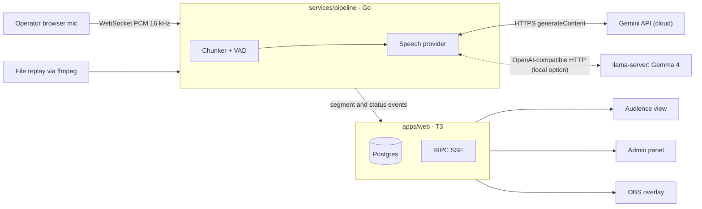

# Tower of Babbage

Open-source, self-hostable real-time transcription and translation for conferences.
Take the live audio of a stage, produce captions in the original language and in
Spanish (or any other target), serve them to the audience on a web page, run many
stages in parallel. Inference runs on Gemini for the demo and MVP; a fully local
option (Gemma 4 on llama.cpp or vLLM) stays available through the same interface.

Built for the [Nerdearla 2026 Vibeathon](VIBEATHON.md). Licensed under
[Apache 2.0](LICENSE).

## What it does

- Live captions per session: original language plus one or more translations.
- Audience web view: pick a session, pick a language, read. Works on phones.
- Many sessions in parallel, each with its own audio source.
- Inference on the Gemini API for the demo and MVP; the same provider
  interface can be backed by a local Gemma 4 served by llama.cpp or vLLM.
- Admin panel for production staff: create and control sessions, watch
  latency and errors, manage glossaries, export transcripts.
- Optional extras: SRT/VTT/TXT export, technical glossary, OBS/vMix overlay,
  extra languages.

## How it works



1. An audio source (browser microphone, file replay, later a stream URL) feeds
   16 kHz mono PCM into the Go pipeline.
2. The pipeline cuts audio into chunks of a few seconds at pauses and sends each
   chunk to a speech provider. The demo and MVP provider is the Gemini API,
   which transcribes and translates in one call. A local provider (Gemma 4
   behind llama.cpp's OpenAI-compatible API, or vLLM) can be selected by
   configuration instead.
3. Resulting segments are pushed to the web app, stored in Postgres and fanned
   out to browsers over Server-Sent Events.

Details: [docs/architecture.md](docs/architecture.md).

## Quick start

Prerequisites: Docker, Node 22 with pnpm, Go 1.24, ffmpeg. A `GEMINI_API_KEY`
is needed for real inference; the mock provider needs no model or key. A GPU
is only required when running the local Gemma 4 path.

```bash
# 1. Infrastructure: Postgres (make infra-up also starts llama-server, only needed for local inference)
make infra-up

# 2. Load the pipeline's local development settings
cp services/pipeline/.env.example services/pipeline/.env
set -a; . services/pipeline/.env; set +a

# 3. Web app and pipeline, in two terminals
make web        # http://localhost:3000, admin at /admin
make pipeline   # control API on :8090, mock provider by default from .env

# To use Gemini (demo/MVP path)
GEMINI_API_KEY=<key> PROVIDER=gemini make pipeline

# To use the local model instead
PROVIDER=openai-compat make pipeline
```

Deployment for an event, hardware guidance and every environment variable:
[docs/deployment.md](docs/deployment.md). On native Windows the `dev.ps1`
task runner covers the inference-only path without Docker: `.\dev.ps1
model-pull`, `.\dev.ps1 inference` and `.\dev.ps1 transcribe`; see the native
Windows section there.

## Repository layout

```
apps/web/           T3 web app: audience view, admin panel, overlay, export, API
services/pipeline/  Go audio pipeline: ingest, chunking, inference, events
packages/contract/  JSON fixtures for the web <-> pipeline contract
infra/              docker compose, Dockerfiles, model download
fixtures/audio/     short speech samples used by tests and demos
scripts/            smoke test and benchmarks
docs/               design docs, roadmap, decisions
```

## Documentation

Start at [docs/README.md](docs/README.md). Agents and contributors: read
[AGENTS.md](AGENTS.md) first, then pick a task from
[docs/roadmap.md](docs/roadmap.md).

## Status

Pre-alpha, under construction during the Vibeathon (September 2026). The
roadmap tracks what exists and what is next.
