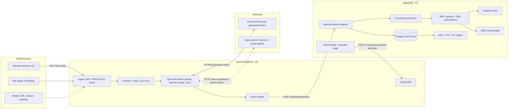
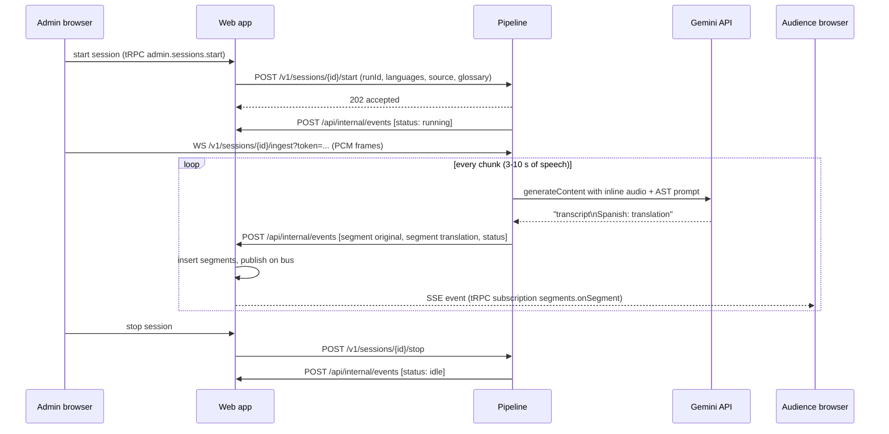

# Architecture

## Goals

- Real-time captions (original language plus translations) for many stages at once.
- Cloud inference for the demo and MVP: the speech provider is the Gemini API.
  Fully local inference (Gemma 4 on llama.cpp or vLLM) plugs into the same
  interface for self-hosted deployments.
- Deployable by any conference with Docker and one config file.
- Clear boundaries so several people or agents can work in parallel.

## Components

| Component | Responsibility | Not responsible for |
| --- | --- | --- |
| Web app (`apps/web`) | Source of truth for sessions, segments, glossary. Public pages. Admin. Control-plane calls to the pipeline. Fan-out of segments to browsers. | Touching audio, calling models |
| Pipeline (`services/pipeline`) | Everything between audio bytes and text segments: ingest, chunking, provider calls, latency accounting, per-session runners. | Persistence, public UI, auth of end users |
| Inference | Turning audio into transcripts and translations through an HTTP API. Interchangeable behind the provider layer: the Gemini API for the demo/MVP, llama-server or vLLM serving Gemma 4 for local deployments. | Anything domain-specific |
| Postgres | Storage for the web app only. | Being reached by the pipeline |

## Data flow for one session

Key properties:

- The web app is the single writer to Postgres. The pipeline is stateless across
  restarts except for in-flight audio; a restarted pipeline receives `start`
  again from the admin panel.
- Segments are idempotent on `(sessionId, runId, chunkIndex, language)`. The
  pipeline may retry a batch; the web app upserts.
- Time inside a run is audio time (`startMs`, `endMs` since run start), derived
  from sample counts, so exports are exact regardless of processing delays.

## Runtime topologies

| Topology | Where things run | Use |
| --- | --- | --- |
| Laptop dev | Everything on one machine. `PROVIDER=mock` (no key, no model) or `PROVIDER=gemini` with `GEMINI_API_KEY`. | Development, UI work, tests |
| Demo laptop | Web, pipeline and Postgres on one machine; `PROVIDER=gemini` calling the Gemini API over the internet. No GPU needed. | Vibeathon demo, MVP |
| Event server (cloud) | One machine runs `infra/compose.yml`: Postgres, pipeline, web; `PROVIDER=gemini`. Needs outbound internet to the API. | Conference deployment (cloud) |
| Event server (local) | One machine with a GPU runs `infra/compose.yml` including llama-server; `PROVIDER=openai-compat`. | Self-hosted conference deployment |
| Scaled event | Gemini: several pipelines bounded by API rate limits. Local: several llama-server instances (one per GPU) in `INFERENCE_URLS`, round-robin per session. Web app still single instance. | 10+ stages |

## Scaling model

- One session = one runner goroutine group inside the pipeline: ingest reader,
  chunker, a bounded request queue, one or more provider workers, an emitter.
- Provider capacity is bounded by `INFERENCE_MAX_CONCURRENCY` (in-flight
  requests). For `openai-compat`, `INFERENCE_URLS` lists the endpoints and the
  per-endpoint semaphore is matched to llama-server `--parallel`; for `gemini`
  the bound is tuned to the API rate limit.
- Backpressure: when a session's request queue is full the chunker merges the
  next chunk into a longer one (up to `CHUNK_MAX_SECONDS`, never past 30 s), then
  drops the oldest unprocessed chunk and emits a `log` event with code
  `chunk_dropped`. Captions lag rather than the process falling over.
- The web app's fan-out is an in-process bus. For multiple web instances, swap
  the bus for Redis pub/sub (see [components/realtime.md](components/realtime.md)).

## Latency budget

Target for the demo (Gemini API over the internet): p95 under 10 s from
words spoken to translated caption visible, one to two live sessions.

| Stage | Typical | Notes |
| --- | --- | --- |
| Chunk accumulation | 1.5-5 s | Half the chunk length on average; pause snapping shortens it |
| API round trip | 1-4 s | Gemini `generateContent` with inline audio: upload, prompt eval, generation of ~40-80 tokens |
| Emit, persist, SSE | < 0.2 s | LAN |

Levers: `CHUNK_TARGET_SECONDS` (shorter chunks reduce latency and quality),
the Gemini model choice, `INFERENCE_MAX_CONCURRENCY`. On the local path: model
size (E2B vs E4B), quantization, GPU backend, number of endpoints.

## Failure handling

| Failure | Behaviour |
| --- | --- |
| Inference endpoint down | Provider marks endpoint unhealthy, retries others, emits `log` `provider_unavailable`; session status `error` with `lastError` until recovery |
| Pipeline crash | Sessions show `error` after the web app's status timeout (no status event for 15 s); admin restarts |
| Web app down | Pipeline buffers events in memory up to a cap and retries with backoff; audience reconnects and catches up via `segments.recent` |
| Operator browser disconnects | Runner keeps the session `running` with a `no_audio` warning; reconnection resumes the same run |
