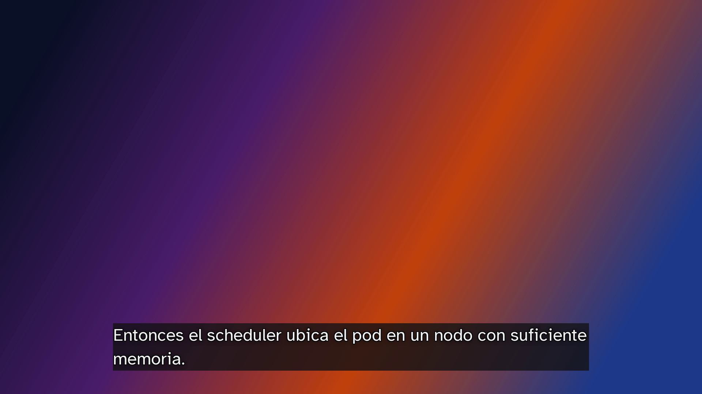
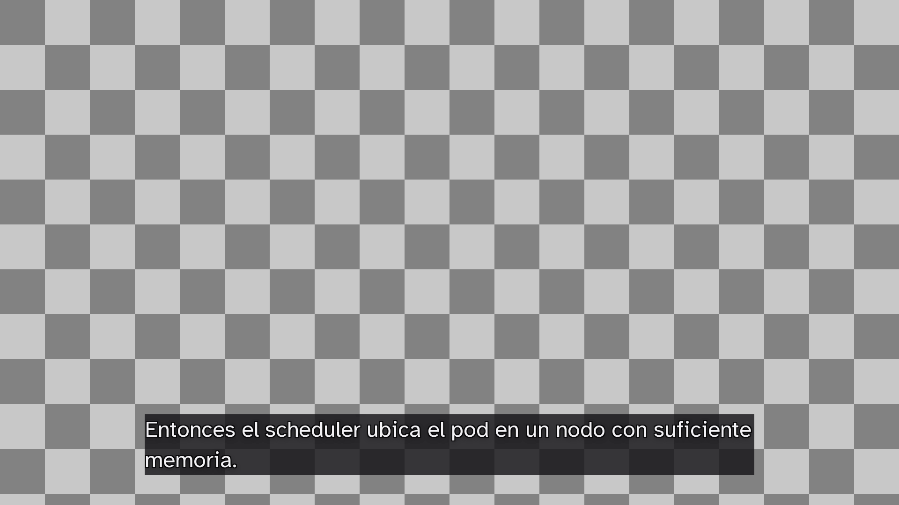

# OBS / vMix overlay

Location: `apps/web/src/app/overlay/[slug]/page.tsx`.

The cheapest integration with every streaming tool is a web page with a
transparent background: OBS Browser Source, vMix Web Browser input, and
hardware encoders with HTML overlays all render it. No plugin, no websocket
protocol per tool.

## Route

`GET /overlay/[slug]?lang=es&lines=2&size=48&align=bottom&bg=band&font=hyperlegible`

| Param | Default | Meaning |
| --- | --- | --- |
| `lang` | first target language | Language to show; `mode=both` stacks original above translation |
| `lines` | `2` | Maximum visible lines; older text scrolls out |
| `size` | `48` | Font size in px at 1080p; scales with viewport width |
| `align` | `bottom` | `bottom` or `top` |
| `bg` | `band` | `band` (semi-opaque `ink-900` band behind text), `box` (per-line boxes), `none` |
| `margin` | `64` | Safe-area margin in px |

Body background is fully transparent (`background: transparent`), no header,
no controls, no cursor. Text uses Atkinson Hyperlegible with a 2 px outline and
drop shadow so it survives `bg=none` over busy video. `font` in the example URL
is reserved: Atkinson Hyperlegible is the only caption font today.

`size` and `margin` are given in px at 1080p and scale with viewport width
(`value * 100vw / 1920`). Caption lines wrap at 42 characters per
[branding.md](../branding.md).

## Behaviour

- Subscribes like the audience page, keeps the last `lines` lines after
  wrapping at the current width.
- New text appears without animation by default (encoders and viewers with
  reduced motion); `anim=fade` enables a 150 ms fade.
- Reconnects silently; shows nothing (rather than an error) while
  disconnected so the stream never displays debugging text.
- Session not live: renders empty.

## Operator setup (OBS / vMix)

The overlay is a plain web page with a transparent background: any tool that
renders a web page can layer it over the program video. The screenshots below
show the `demo-en` session streaming Spanish captions.

### Before you start

- The machine running OBS/vMix must reach the web app over the network. The
  URL is `http://<host>:<port>/overlay/<slug>` — the deployed site URL at an
  event, or `http://localhost:3000` on a local run.
- The slug is the last segment of the audience URL `/s/<slug>`; the session
  page in `/admin` links to both.
- Pick the caption language from the session's target languages with `lang`
  (Spanish: `?lang=es`).
- Sanity check: while the session is live, open the URL in a normal browser —
  captions float at the bottom over nothing. An empty page when the session
  is not live is by design.

Common recipes (session slug `gran-sala`):

| Look | URL |
| --- | --- |
| Bottom third, Spanish (defaults) | `/overlay/gran-sala?lang=es` |
| Original above translation | `...?mode=both` |
| Own lower-third graphics behind the text | `...?lang=es&bg=none` |
| Top-aligned | `...?lang=es&align=top` |
| Larger text, three lines | `...?lang=es&size=64&lines=3` |

This is what the URL renders while a session is running — here composited
over a test image, the same way the streaming tool composites it over video:

### OBS Studio

1. In the **Sources** dock, click `+` > **Browser**. Name it (e.g.
   `Captions`).

2. In the source properties:
   - **URL**: paste the overlay URL.
   - **Width** `1920`, **Height** `1080`, **FPS** `30`.
   - Leave **Custom CSS** empty; the page styles itself.
   - Uncheck **Shutdown source when not visible** so switching scenes does
     not blank the captions.
   - Check **Refresh browser when scene becomes active** so a stuck
     connection reloads when the scene is re-entered.

3. The source matches the 1080p canvas, so leave it filling the frame: the
   page already keeps the safe margin. Do not crop or resize it.

### vMix

1. **Add Input** > **Web Browser**.
2. Paste the URL; set Width `1920`, Height `1080`.
3. The URL lands as a normal input — key it over the program with an
   Overlay/Mix channel or a layer on the main output.

### Troubleshooting

| Symptom | Cause and fix |
| --- | --- |
| Blank page, nothing ever shows | Session not `running`, wrong slug, or the web app unreachable from the streaming PC — open the URL in a normal browser first |
| Captions cropped or off-position | Source not filling the frame; set Width/Height to the canvas size and leave the source unscaled |
| Captions blank after switching scenes | **Shutdown source when not visible** is checked — uncheck it |
| Doubled captions | The overlay source was added twice |

## Backlog

- obs-websocket client in the pipeline that pushes captions with
  `SendStreamCaption` for platforms that ingest CEA-608 from OBS.
- Per-session overlay presets stored in the database.

## Verification

- Playwright (backlog) or manual: open the URL in a browser with a checkered
  background extension; text is readable, background transparent.
- Manual with OBS: add the source during a `make smoke` run; captions appear
  and scroll with at most `lines` visible.
- The render screenshots in this doc were produced at 1920x1080 with headless
  Chromium against a `running` `demo-en` session (status heartbeat and
  segments posted to `/api/internal/events`), then composited over test
  backgrounds with ffmpeg. `docs/images/overlay/overlay-checkered.png` is the
  transparency proof:

  
