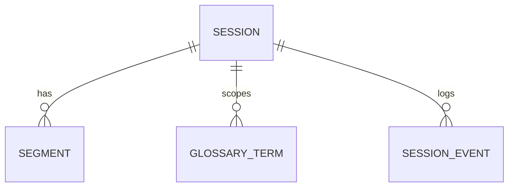

# Domain model

Owned by the web app. The pipeline only ever sees the subset carried by the
[contract](contract.md). Field names below are the canonical ones; the contract,
the Drizzle schema and the Go structs use them verbatim (camelCase in JSON and
TypeScript, snake_case only in SQL column names).

## Entities

### Session

One stage or talk feed. Long-lived; can be started and stopped many times. Each
start creates a new run identified by `runId`.

| Field | Type | Notes |
| --- | --- | --- |
| `id` | uuid | Primary key |
| `slug` | text, unique | URL segment for the audience, for example `gran-sala` |
| `title` | text | Shown to the audience |
| `room` | text | Free text, for example `Auditorio` |
| `roomColor` | text | One of the accent token names in [branding.md](branding.md), for example `violet` |
| `sourceLanguage` | text | `en`, `es`, `pt`, ... |
| `targetLanguages` | text[] | Ordered; first is the default for the audience |
| `sourceType` | enum | `browser_mic`, `file_replay`, `stream_url`, `device` |
| `sourceConfig` | jsonb | Per type, see [components/ingest.md](components/ingest.md) |
| `translationMode` | enum | `ast` (one audio call yields transcript and translation) or `asr_then_text` |
| `status` | enum | `idle`, `starting`, `running`, `stopping`, `error` |
| `currentRunId` | uuid, nullable | Run created by the latest start |
| `lastError` | text, nullable | Latest error message from the pipeline |
| `startedAt`, `stoppedAt` | timestamptz, nullable | Wall clock of the current run |
| `createdAt`, `updatedAt` | timestamptz | |

Status transitions: `idle -> starting` (admin start), `starting -> running`
(first status event from the pipeline), `running -> stopping` (admin stop),
`stopping -> idle` (pipeline confirms), any `-> error` (pipeline reports or
status timeout), `error -> starting` (admin restart).

### Segment

One caption unit in one language. A chunk of audio produces one `original`
segment plus one `translation` segment per target language.

| Field | Type | Notes |
| --- | --- | --- |
| `id` | uuid | |
| `sessionId` | uuid | FK |
| `runId` | uuid | Groups segments of one start/stop cycle |
| `chunkIndex` | int | 0-based index of the audio chunk within the run |
| `kind` | enum | `original`, `translation` |
| `language` | text | Language of `text` |
| `text` | text | |
| `speaker` | text, nullable | Provider-assigned label like `S1`; shared by the original and its translations of one chunk (contract v2) |
| `isFinal` | bool | Always `true` in M1; partials are backlog |
| `startMs`, `endMs` | int | Audio time since run start |
| `emittedAt` | timestamptz | Wall clock when the pipeline emitted it |
| `latencyMs` | int | `emittedAt - (run wall start + endMs)`, computed by the pipeline |
| `createdAt` | timestamptz | |

Unique on `(sessionId, runId, chunkIndex, language)`; the events endpoint upserts on it.

### GlossaryTerm

| Field | Type | Notes |
| --- | --- | --- |
| `id` | uuid | |
| `sessionId` | uuid, nullable | `null` means global (applies to every session) |
| `term` | text | As it should appear in the transcript |
| `translation` | text, nullable | Preferred rendering in the target language; `null` keeps the term untranslated |
| `notes` | text, nullable | Free text for humans, not sent to the model |
| `createdAt` | timestamptz | |

### SessionEvent

Operational log used by the monitoring view. Written from pipeline `status` and
`log` events; never shown to the audience.

| Field | Type | Notes |
| --- | --- | --- |
| `id` | bigserial | |
| `sessionId` | uuid | |
| `runId` | uuid, nullable | |
| `level` | enum | `info`, `warn`, `error` |
| `code` | text | Machine-readable, see contract error codes |
| `message` | text | |
| `data` | jsonb, nullable | |
| `createdAt` | timestamptz | |

Runtime stats (`queueDepth`, latency percentiles) are not persisted per tick;
the web app keeps the latest `status` payload per session in memory and exposes
it to the admin panel.

## Relationships



## Drizzle sketch

```ts
export const sessions = pgTable("sessions", {
  id: uuid().primaryKey().defaultRandom(),
  slug: text().notNull().unique(),
  title: text().notNull(),
  room: text().notNull().default(""),
  roomColor: text("room_color").notNull().default("violet"),
  sourceLanguage: text("source_language").notNull(),
  targetLanguages: text("target_languages").array().notNull(),
  sourceType: sourceTypeEnum("source_type").notNull(),
  sourceConfig: jsonb("source_config").notNull().default({}),
  translationMode: translationModeEnum("translation_mode").notNull().default("ast"),
  status: sessionStatusEnum().notNull().default("idle"),
  currentRunId: uuid("current_run_id"),
  lastError: text("last_error"),
  startedAt: timestamp("started_at", { withTimezone: true }),
  stoppedAt: timestamp("stopped_at", { withTimezone: true }),
  createdAt: timestamp("created_at", { withTimezone: true }).notNull().defaultNow(),
  updatedAt: timestamp("updated_at", { withTimezone: true }).notNull().defaultNow(),
});

export const segments = pgTable(
  "segments",
  {
    id: uuid().primaryKey().defaultRandom(),
    sessionId: uuid("session_id").notNull().references(() => sessions.id, { onDelete: "cascade" }),
    runId: uuid("run_id").notNull(),
    chunkIndex: integer("chunk_index").notNull(),
    kind: segmentKindEnum().notNull(),
    language: text().notNull(),
    text: text().notNull(),
    speaker: text(),
    isFinal: boolean("is_final").notNull().default(true),
    startMs: integer("start_ms").notNull(),
    endMs: integer("end_ms").notNull(),
    emittedAt: timestamp("emitted_at", { withTimezone: true }).notNull(),
    latencyMs: integer("latency_ms").notNull(),
    createdAt: timestamp("created_at", { withTimezone: true }).notNull().defaultNow(),
  },
  (t) => [
    uniqueIndex("segments_chunk_lang").on(t.sessionId, t.runId, t.chunkIndex, t.language),
    index("segments_session_run_start").on(t.sessionId, t.runId, t.startMs),
  ],
);
```

`glossary_terms` and `session_events` follow the tables above one to one.
